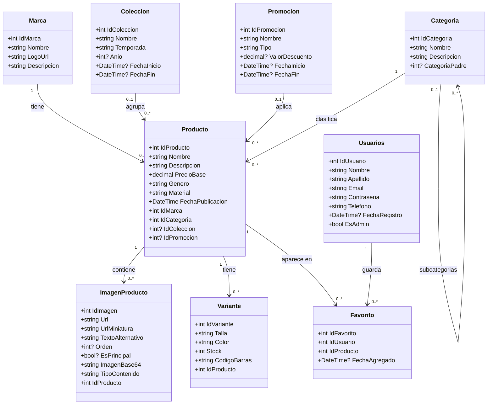

# Documentación del sistema.

---

---

## Información del Producto

**Nombre del producto:** TUROPA.COM - Catálogo de Ropa en Línea.

**Materia:** Desarrollo e Implementación de Sistemas

**Fecha de última actualización:** 17/05/2026

## Integrantes del Equipo 5

| Apellido(s)      | Nombre(s)    |
| ---------------- | ------------ |
| Estrada Rios     | Daiana       |
| González Erenas  | Jean Paul    |
| Hernández López  | Jesús Noel   |
| Hernández Valdez | Ángel Jasiel |

---

## 1. Introducción

<p align="justify">
Turopa.com es una aplicación web tipo revista digital que funciona como un catálogo de ropa en línea, diseñado para que los usuarios puedan explorar productos de forma rápida, intuitiva y visualmente atractiva. A diferencia de un e-commerce tradicional, este sistema se enfoca exclusivamente en la consulta y visualización de prendas, sin requerir autenticación de usuarios ni procesos de compra en línea.
El proyecto fue desarrollado siguiendo las fases de análisis y diseño de software, transformando los requerimientos iniciales en una estructura técnica clara que comprende el diagrama de clases, el diseño de base de datos, la interfaz de usuario y la arquitectura del sistema. El objetivo principal es ofrecer una experiencia de navegación fluida que permita al usuario descubrir productos a través de categorías, filtros y elementos visuales que faciliten la toma de decisiones.

Este documento describe los componentes técnicos y funcionales del sistema, sirviendo como referencia para su implementación, mantenimiento y posibles expansiones futuras.

</p>

---

## 2. Resumen del Sistema

Es una plataforma web -turopa.com- que presenta un catálogo digital de prendas de vestir organizado por categorías (Novedades, Promociones, Hombre, Mujer, Todo). El sistema permite al usuario navegar entre productos, aplicar filtros de búsqueda y visualizar información detallada de cada artículo sin necesidad de registrarse.

### 2.1. Características principales

- **Catálogo visual**: muestra productos con imagen, descripción breve y precio.
- **Navegación por categorías**: secciones específicas para Hombre, Mujer, Novedades, Promociones y Todo.
- **Sistema de filtros**: permite filtrar prendas por tipo, talla y rango de precio.
- **Banner promocional**: destaca ofertas y campañas vigentes.
- **Barra de búsqueda**: permite localizar prendas específicas por nombre.
- **Diseño responsivo y limpio**: pensado para una experiencia de usuario intuitiva en navegador de escritorio.

### 2.2. Arquitectura

El sistema se construye bajo una **arquitectura en capas Cliente-Servidor**, dividida en tres niveles:

| Capa              | Responsabilidad                                  | Tecnologías                                       |
| ----------------- | ------------------------------------------------ | ------------------------------------------------- |
| **Frontend**      | Presentación e interacción con el usuario        | HTML, CSS, JavaScript                             |
| **Backend**       | Lógica de negocio y procesamiento de solicitudes | C#, API REST (Controlador, Servicio, Repositorio) |
| **Base de Datos** | Almacenamiento persistente de información        | SQL Server (Modelo relacional)                    |

### 2.3. Entidades principales del modelo de datos

- `Producto` — información general de cada prenda.
- `Variante` — combinaciones de talla, color y stock por producto.
- `Categoría` — clasificación jerárquica de prendas.
- `Marca` — fabricantes asociados a los productos.
- `Colección` — agrupaciones por temporada o año.
- `Promoción` — descuentos aplicables a productos.
- `ImagenProducto` — recursos visuales asociados a cada artículo.

---

## 3. Requisitos

### 3.1 Requisitos Funcionales

| Requisito                           | Descripción                                                                                     |
| ----------------------------------- | ----------------------------------------------------------------------------------------------- |
| Visualización de catálogo           | El sistema debe mostrar un listado de productos con imagen, descripción breve y precio.         |
| Navegación por categorías           | El usuario podrá acceder a secciones específicas: Novedades, Promociones, Hombre, Mujer y Todo. |
| Filtrado de productos               | El sistema debe permitir filtrar prendas por tipo de prenda, talla y rango de precio.           |
| Búsqueda de prendas                 | El usuario podrá buscar productos específicos a través de una barra de búsqueda.                |
| Visualización de promociones        | El sistema debe mostrar un banner promocional con las ofertas vigentes.                         |
| Gestión de variantes                | Cada producto podrá tener múltiples variantes (talla, color, stock).                            |
| Cálculo de precio con descuento     | El sistema debe aplicar promociones vigentes sobre el precio base de los productos.             |
| Categorización jerárquica           | Las categorías podrán contener subcategorías (relación padre/hijo).                             |
| Visualización de imágenes múltiples | Cada producto puede tener varias imágenes, con una marcada como principal.                      |
| Navegación rápida                   | El sistema debe ofrecer un botón "Ir Arriba" y acceso al inicio mediante el logotipo.           |
| Indicador de sección activa         | La opción seleccionada en el menú debe cambiar de color para indicar la ubicación actual.       |
| Acceso a información de la empresa  | El footer debe mostrar información del negocio, ayuda, tiendas físicas y redes sociales.        |

### 3.2 Requisitos No Funcionales}

| Requisito      |
| -------------- |
| Usabilidad     |
| Rendimiento    |
| Mantenibilidad |
| Escalabilidad  |
| Compatibilidad |
| Disponibilidad |
| Seguridad      |

### 3.3 Tecnicos

<p align="justify"> Los requisitos técnicos definen las herramientas, lenguajes, frameworks y plataformas necesarias para construir, ejecutar y mantener el sistema Turopa.com. </p>

| Requisito     | Descripción                             |
| ------------- | --------------------------------------- |
| Frontend      | HTML, CSS, JavaScript, Bootstrap        |
| Backend       | C#, ASP.NET Core, Entity Framework Core |
| Base de Datos | SQL Server                              |
| API REST      | Controlador, Servicio, Repositorio      |
| Servidor      | IIS, Windows Server                     |
| Hosting       | Cloud (Azure)                           |

---

## 3.4 De Arquitectura del sistema

<p align="justify"> La arquitectura del sistema define cómo se organizan y comunican los componentes del sistema para lograr sus objetivos. </p>

| Requisito           | Descripción                                                                                                                                                                         |
| ------------------- | ----------------------------------------------------------------------------------------------------------------------------------------------------------------------------------- |
| Cliente-Servidor    | El sistema está diseñado como una aplicación Cliente-Servidor, donde el cliente (navegador web) se comunica con el servidor para acceder a los datos y funcionalidades del sistema. |
| Capas de aplicación | El sistema está dividido en capas de aplicación, cada una con responsabilidades específicas: frontend, backend y base de datos.                                                     |


## 4. Instalacion del sistema

## Requisitos Previos

Antes de ejecutar el proyecto, la computadora debe tener instalado lo siguiente.

### 1. Git

Necesario para clonar o descargar el repositorio.

Sitio oficial:

```txt
https://git-scm.com/downloads
```

Verificar instalación:

```bash
git --version
```

### 2. Node.js y npm

Necesario para ejecutar el frontend en Angular.

Sitio oficial:

```txt
https://nodejs.org/
```

Verificar instalación:

```bash
node -v
npm -v
```

### 3. Angular CLI

Instalar Angular CLI de forma global:

```bash
npm install -g @angular/cli
```

Verificar instalación:

```bash
ng version
```

### 4. .NET SDK 9

Necesario para ejecutar el backend en ASP.NET Core.

Sitio oficial:

```txt
https://dotnet.microsoft.com/download
```

Verificar instalación:

```bash
dotnet --version
```

### 5. SQL Server Management Studio, SSMS

Recomendado para restaurar el backup `.bak`.

Sitio oficial:

```txt
https://learn.microsoft.com/sql/ssms/download-sql-server-management-studio-ssms
```

---

## Estructura del Proyecto

Después de descargar el repositorio, la estructura principal debe verse de la siguiente forma:

```txt
CATALOGO DE ROPA EN LINEA
├─ CatalogoRopa
│  ├─ frontend
│  │  └─ CatalogoRopa-FrontEnd
│  ├─ backend
│  │  └─ CatalogoRopa-BackEnd
│  └─ Base de datos
│     └─ CatalogoRopaDB.bak
└─ package-lock.json
```

El sistema está dividido en tres partes principales:

```txt
Frontend: Angular
Backend: ASP.NET Core .NET 9
Base de datos: SQL Server
```

---

## Paso 1: Descargar el Repositorio

Recomiendo crear una nueva carpeta en donde se clonara el repositorio si desea almacenarlo en alguna ruta en especifico, de lo contrario el repositorio se clonara 
en la ruta donde se abrio la terminal.

Si se usa Git, ejecutar:

```bash
git clone https://github.com/AngJas/CatalogoRopa.git
```


---

## Paso 2: Restaurar la Base de Datos

El proyecto incluye un backup en la siguiente ruta:

```txt
CatalogoRopa\Base de datos\CatalogoRopaDB.bak
```

Para restaurarlo usando SQL Server Management Studio:

1. Abrir **SQL Server Management Studio**.
2. Conectarse al servidor local, por ejemplo:

```txt
.\SQLEXPRESS
```

o:

```txt
localhost\SQLEXPRESS
```

3. Hacer clic derecho en **Databases**.
4. Seleccionar **Restore Database**.
5. Elegir la opción **Device**.
6. Seleccionar los 3 puntos a la derecha de **Device**.
7. Presionar **Add**.
8. Buscar y seleccionar el archivo:

```txt
CatalogoRopaDB.bak
```

8. En el nombre de la base de datos colocar:

```txt
CatalogoRopaDB
```
Es de suma importancia que el nombre sea exactamente el mismo, de lo contrario se tendran que hacer modificaciones en el backend y especificar el nombre colocado.

9. Presionar **OK** para restaurar.

Al finalizar debe existir una base de datos llamada:

```txt
CatalogoRopaDB
```

---

## Paso 3: Configurar la Cadena de Conexión

En el backend, abrir el archivo:

```txt
CatalogoRopa\backend\CatalogoRopa-BackEnd\appsettings.json
```

Actualmente la conexión esta configurada de la siguiente forma:

```json
"ConnectionStrings": {
  "DefaultConnection": "Server=ACCD62\\SQLEXPRESS;Database=CatalogoRopaDB;Trusted_Connection=True;TrustServerCertificate=True;"
}
```

La persona que instale el sistema debe cambiar `ACCD62\\SQLEXPRESS` por el nombre de su servidor SQL.

Puedes saber cual es el servidor de tu SQL server al abrir SQL server y verificar el siguiente campo: 


Se sustituye el servidor especificado en el backend por el nombre del servidor que aparece al abrir sql server.


---
## Paso 4: Instalar Dependencias del Backend

Entrar a la carpeta del backend:

```bash
cd CatalogoRopa/backend/CatalogoRopa-BackEnd
```

Restaurar paquetes NuGet:

```bash
dotnet restore
```

El backend usa estas dependencias principales:

```txt
Microsoft.AspNetCore.Authentication.JwtBearer
Microsoft.EntityFrameworkCore.SqlServer
Microsoft.EntityFrameworkCore.Tools
Swashbuckle.AspNetCore
```

Estas dependencias se instalan automáticamente con `dotnet restore`.

---

## Paso 5: Ejecutar el Backend

Desde la carpeta:

```txt
CatalogoRopa\backend\CatalogoRopa-BackEnd
```

Ejecutar:

```bash
dotnet run
```

El backend debería iniciar en:

```txt
http://localhost:5260
```

La API principal queda disponible en:

```txt
http://localhost:5260/api
```


Endpoints principales:

```http
GET  http://localhost:5260/api/Ropa
POST http://localhost:5260/api/Ropa
POST http://localhost:5260/api/Auth/register
POST http://localhost:5260/api/Auth/login
GET  http://localhost:5260/api/
```

---

## Paso 6: Instalar Dependencias del Frontend

Abrir otra terminal y entrar a:

```bash
cd CatalogoRopa/frontend/CatalogoRopa-FrontEnd
```

Instalar dependencias:

```bash
npm install
```

El frontend usa principalmente:

```txt
Angular 21
Bootstrap
RxJS
TypeScript
Zone.js
```

---

## Paso 7: Ejecutar el Frontend

Desde la carpeta del frontend:

```bash
npm start
```

También puede ejecutarse con:

```bash
ng serve
```

Angular normalmente se ejecutará en:

```txt
http://localhost:4200
```

Abrir esa dirección en el navegador.


## Notas Importantes

El backend y el frontend deben ejecutarse al mismo tiempo.

El frontend espera que la API esté disponible en:

```txt
http://localhost:5260/api
```

Esta URL se encuentra configurada en los archivos:

```txt
src\app\services\ropa.service.ts
src\app\services\auth.service.ts
```

Si el backend se ejecuta en otro puerto, se deben actualizar esas URLs.

También es importante que la base de datos restaurada se llame exactamente:

```txt
CatalogoRopaDB
```

Si se usa otro nombre, también debe modificarse en `appsettings.json`.

---

## Comandos Resumidos

### Backend

```bash
cd CatalogoRopa/backend/CatalogoRopa-BackEnd
dotnet restore
dotnet run
```

### Frontend

```bash
cd CatalogoRopa/frontend/CatalogoRopa-FrontEnd
npm install
npm start
```

### URLs del Sistema

```txt
Frontend: http://localhost:4200
Backend:  http://localhost:5260
Swagger:  http://localhost:5260/swagger
```

---

## Resultado Esperado

Después de completar todos los pasos:

1. La base de datos estará restaurada en SQL Server.
2. El backend estará ejecutándose en `http://localhost:5260`.
3. El frontend estará ejecutándose en `http://localhost:4200`.
4. El usuario podrá navegar por el catálogo, registrarse, iniciar sesión y probar las funciones disponibles del sistema.


## 5. Uso del Sistema

El sistema **Turopa.com** está diseñado para permitir que los usuarios consulten los productos disponibles en el catálogo digital. Desde la página principal se pueden visualizar prendas, imágenes, precios e información básica de cada producto.

---

### 5.1 Funciones Disponibles Actualmente

#### Usuarios generales

Los usuarios que no cuentan con permisos de administrador pueden realizar las siguientes acciones:

- Visualizar productos del catálogo.
- Consultar productos almacenados en SQL Server.
- Ver imágenes de los productos registrados.
- Registrarse en el sistema.
- Iniciar sesión.
- Cerrar sesión.

#### Usuarios administradores

Los usuarios administradores cuentan con todas las funciones anteriores y, adicionalmente, pueden:

- Crear productos desde el formulario de administración.
- Actualizar productos existentes.
- Eliminar productos registrados.
- Consultar un listado con todos los productos registrados.
- Acceder al botón de administración de inventario.
- Visualizar mensajes emergentes de éxito, error o carga.

> Nota: Actualmente un usuario no puede registrarse directamente como administrador. El permiso de administrador debe asignarse desde la base de datos.

---

### 5.2 Pantalla Principal

Al ingresar al sistema se muestra la pantalla principal del catálogo:


En la parte superior se muestra la barra de navegación, donde aparecen las siguientes opciones:

- Novedades
- Promociones
- Hombres
- Mujeres
- Todo

Estas opciones se encuentran visibles en la interfaz, pero actualmente no redirigen a secciones funcionales. Su funcionamiento se contempla para una entrega futura.

También se muestran las opciones de autenticación:

- Iniciar sesión
- Registrarse

---

### 5.3 Registro de Usuario

Al seleccionar la opción **Registrarse**, se muestra el formulario de creación de cuenta:


El usuario debe llenar correctamente los campos solicitados. Al completar el registro, el sistema inicia sesión automáticamente y redirige al usuario a la página principal.


Cuando la sesión está iniciada, en la barra de navegación aparece el nombre del usuario junto a la opción para cerrar sesión.

---

### 5.4 Acceso de Administrador

Si el usuario cuenta con permisos de administrador, se muestra un icono con forma de caja en la barra de navegación. Este botón permite acceder a la administración del inventario digital.


Al hacer clic en este icono, el administrador es enviado a la pantalla de administración de productos.

---

### 5.5 Administración de Inventario

En la sección de administración de inventario, el administrador puede realizar las siguientes acciones:

- Agregar productos.
- Editar productos existentes.
- Eliminar productos.
- Consultar el listado de productos registrados.


---

### 5.6 Agregar Producto

Para agregar un nuevo producto, el administrador debe llenar el formulario con los datos correspondientes, como nombre, descripción, precio, género, material, marca, categoría, colección, promoción e imagen del producto.


Al guardar el producto, el sistema mostrará un mensaje de confirmación si el registro fue exitoso. En caso de que ocurra algún problema, se mostrará un mensaje de error.


---

### 5.7 Editar Producto

Desde el listado de productos registrados, el administrador puede seleccionar un producto para cargar sus datos en el formulario.


Una vez cargado el producto, se pueden modificar sus datos y guardar los cambios. En el siguiente ejemplo se actualiza el género de la prenda de **Hombre** a **Mujer**.


---

### 5.8 Eliminar Producto

Para eliminar un producto, primero debe seleccionarse desde el listado. Una vez cargado en el formulario, el administrador puede usar la opción **Eliminar producto**.


Después de eliminarlo, el producto deja de aparecer en el listado y ya no estará disponible en el catálogo.

---

## 6. Base de datos (Modelado)

<p align="justify"> La base de datos de Turopa.com almacena información sobre los productos, categorías, marcas, colecciones, promociones e imágenes, implementando SQL Server Management studio y se cuenta con los siguientes elementos: </p>

|Tabla  |Descripcion                                                                       |
|-------|----------------------------------------------------------------------------------|
|Usuario  |Tabla encargada de administrar los datos de los usuarios registrados             |
|Producto |Tabla encargada de administrar los datos pertinentes de los productos almacenados|
|Categoria|Tabla encargada de determinar la categoria a la que pertenece un producto       |
|Variante|Tabla encargada de determinar la variante del producto (misma camiseta, diferente color)    |
|Marca|Tabla encargada de determinar la marca del producto        |
|Favorito|Tabla encargada de determinar si un producto es el favorito de algun usuario      |
|ImagenProducto|Tabla encargada de proporcionar las imagenes al producto, imagen principal e imagenes adicionales para mostar el producto     |
|Promocion|Tabla encargada de determinar si un producto cuenta con una promocion activa o no      |
|coleccion|Tabla encargada de determinar a que coleccion pertenece cada producto, invierno/verano/etc..      |

Diagrama Entidad-Relacion obtenido de sql server management studio: 


## Diagrama de Clases



### Descripción del Diagrama

El sistema se centra en la entidad `Producto`, la cual se relaciona con una `Marca`, una `Categoria`, una `Coleccion` opcional y una `Promocion` opcional.

Cada producto puede tener múltiples imágenes mediante `ImagenProducto`, múltiples variantes mediante `Variante` y puede ser agregado como favorito por distintos usuarios mediante la entidad `Favorito`.

La entidad `Usuarios` almacena la información de las cuentas registradas, incluyendo si el usuario tiene permisos de administrador mediante el campo `EsAdmin`.

La entidad `Categoria` permite una relación jerárquica, ya que una categoría puede tener una categoría padre y varias subcategorías.


