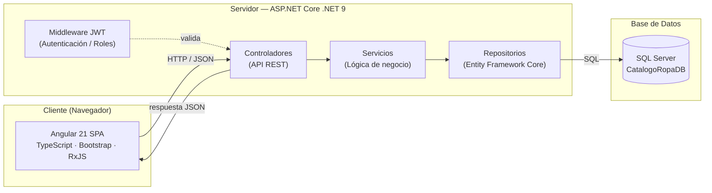
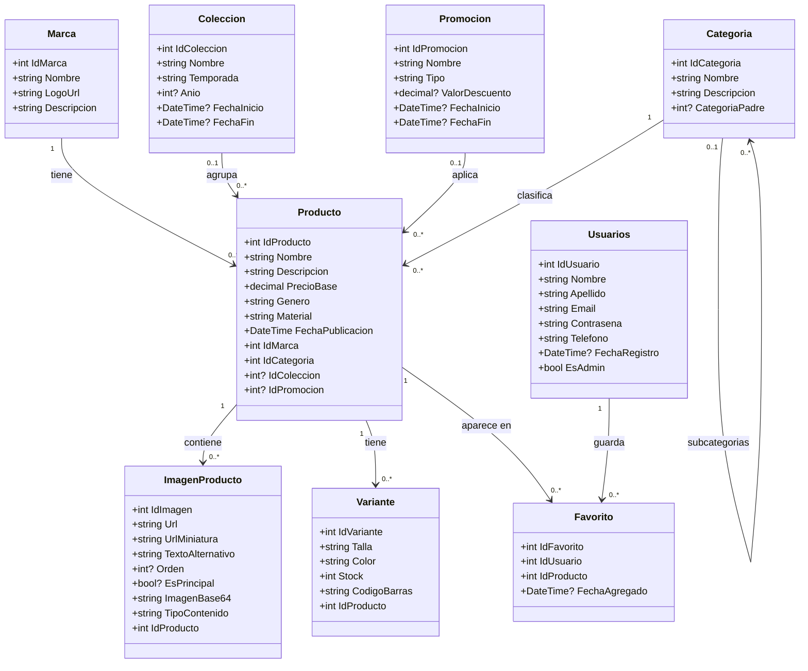

# Documentación del sistema.

---


## Información del Producto

**Nombre del producto:** TUROPA.COM - Catálogo de Ropa en Línea.

**Materia:** Desarrollo e Implementación de Sistemas

**Fecha de última actualización:** 17/05/2026

## Integrantes del Equipo 5

| Alumno(s)     
| -------------------------- |
| Estrada Rios Daiana       |
| González Erenas Jean Paul    |
| Hernández López Jesús Noel   |
| Hernández Valdez Ángel Jasiel |

---

## 1. INTRODUCCIÓN

### 1.1 Descripción General

<p align="justify">
Turopa.com es una aplicación web tipo revista digital que funciona como un catálogo de ropa en línea, diseñado para que los usuarios puedan explorar productos de forma rápida, intuitiva y visualmente atractiva. A diferencia de un e-commerce tradicional, este sistema se enfoca exclusivamente en la consulta y visualización de prendas, sin requerir autenticación de usuarios ni procesos de compra en línea.
El proyecto fue desarrollado siguiendo las fases de análisis y diseño de software, transformando los requerimientos iniciales en una estructura técnica clara que comprende el diagrama de clases, el diseño de base de datos, la interfaz de usuario y la arquitectura del sistema. El objetivo principal es ofrecer una experiencia de navegación fluida que permita al usuario descubrir productos a través de categorías, filtros y elementos visuales que faciliten la toma de decisiones.


</p>

### 1.2 Cobertura o Alcance


- Visualización del catálogo de prendas con imagen, descripción y precio.
- Consulta de productos almacenados en SQL Server a través de una API REST.
- Registro, inicio y cierre de sesión de usuarios.
- Rol de administrador con operaciones CRUD sobre los productos.
- Gestión de variantes (talla, color, stock), imágenes múltiples y promociones por producto.


---

## 2. RESUMEN DEL SISTEMA

Es una plataforma web -turopa.com- que presenta un catálogo digital de prendas de vestir organizado por categorías (Novedades, Promociones, Hombre, Mujer, Todo). El sistema permite al usuario navegar entre productos, aplicar filtros de búsqueda y visualizar información detallada de cada artículo sin necesidad de registrarse.

### 2.1. Objetivo General
Ofrecer una plataforma web que presente un catálogo digital de prendas de vestir organizado por categorías (Novedades, Promociones, Hombre, Mujer, Todo), permitiendo al usuario navegar, filtrar y visualizar información detallada de cada artículo sin necesidad de registrarse, y brindando a los administradores las herramientas para mantener el inventario actualizado.


### 2.1. Características principales

- **Catálogo visual**: muestra productos con imagen, descripción breve y precio.
- **Navegación por categorías**: secciones específicas para Hombre, Mujer, Novedades, Promociones y Todo.
- **Sistema de filtros**: permite filtrar prendas por tipo, talla y rango de precio.
- **Banner promocional**: destaca ofertas y campañas vigentes.
- **Barra de búsqueda**: permite localizar prendas específicas por nombre.
- **Diseño responsivo y limpio**: pensado para una experiencia de usuario intuitiva en navegador de escritorio.


### 2.2. Arquitectura

El sistema se construye bajo una **arquitectura en capas Cliente-Servidor**, dividida en tres niveles:

| Capa              | Responsabilidad                                  | Tecnologías                                       |
| ----------------- | ------------------------------------------------ | ------------------------------------------------- |
| **Frontend**      | Presentación e interacción con el usuario        | HTML, CSS, JavaScript                             |
| **Backend**       | Lógica de negocio y procesamiento de solicitudes | C#, API REST (Controlador, Servicio, Repositorio) |
| **Base de Datos** | Almacenamiento persistente de información        | SQL Server (Modelo relacional)                    |

### 2.3. Entidades principales del modelo de datos

- `Producto` — información general de cada prenda.
- `Variante` — combinaciones de talla, color y stock por producto.
- `Categoría` — clasificación jerárquica de prendas.
- `Marca` — fabricantes asociados a los productos.
- `Colección` — agrupaciones por temporada o año.
- `Promoción` — descuentos aplicables a productos.
- `ImagenProducto` — recursos visuales asociados a cada artículo.

---

## 3. REQUISITOS

### 3.1 Requisitos Funcionales

- Visualización de catálogo           
- Navegación por categorías           
- Filtrado de productos              
- Búsqueda de prendas                 
- Visualización de promociones        
- Gestión de variantes                
- Cálculo de precio con descuento    
- Categorización jerárquica          
- Visualización de imágenes múltiples 
- Navegación rápida      
- Indicador de sección activa    
- Acceso a información de la empresa

### 3.2 Requisitos No Funcionales

- Usabilidad     
- Rendimiento   
- Mantenibilidad 
- Escalabilidad 
- Compatibilidad 
- Disponibilidad
- Seguridad   

### 3.3 Tecnicos

- Frontend    
- Backend      
- Base de Datos 
- API REST 
- Servidor   
- Hosting   


### 3.4 Lenguajes de Programación

- TypeScript -Lógica del frontend en Angular.   
- HTML / CSS -Estructura y estilos de la interfaz.  
- C# - Lógica de negocio del backend (ASP.NET Core).  
- SQL (T-SQL) -  Definición y consulta de datos en SQL Server.  

### 3.5 Frameworks

Frontend:
- Angular 21 - Construcción de la SPA y componentes de interfaz.
- Bootstrap - Sistema de diseño responsivo y estilos base. 

Backend:
- ASP.NET Core (.NET 9)-Exposición de la API REST y lógica de negocio.
- Entity Framework Core- ORM para el acceso y mapeo de datos con SQL Server. 

### 3.6 Dependencias (librerías)

**Backend (NuGet):**

```txt
Microsoft.AspNetCore.Authentication.JwtBearer   // Autenticación con tokens JWT
Microsoft.EntityFrameworkCore.SqlServer         // Proveedor EF Core para SQL Server
Microsoft.EntityFrameworkCore.Tools             // Migraciones y herramientas de EF
Swashbuckle.AspNetCore                          // Documentación de la API (Swagger)
```

**Frontend (npm):**

```txt
@angular/core / @angular/cli   // Núcleo y CLI de Angular 21
rxjs                           // Programación reactiva (observables)
bootstrap                      // Estilos y componentes responsivos
zone.js                        // Detección de cambios de Angular
typescript                     // Lenguaje base del frontend
```


### 3.7 Arquitectura del sistema


- Cliente-Servidor (El sistema está diseñado como una aplicación Cliente-Servidor, donde el cliente (navegador web) se comunica con el servidor para acceder a los datos y funcionalidades del sistema).
- Capas de aplicación (El sistema está dividido en capas de aplicación, cada una con responsabilidades específicas: frontend, backend y base de datos).

### 3.8 Diagrama de Arquitectura


```mermaid
flowchart LR
    subgraph Cliente["Cliente (Navegador)"]
        A["Angular 21 SPA<br/>TypeScript · Bootstrap · RxJS"]
    end

    subgraph Servidor["Servidor — ASP.NET Core .NET 9"]
        direction TB
        B["Controladores<br/>(API REST)"]
        C["Servicios<br/>(Lógica de negocio)"]
        D["Repositorios<br/>(Entity Framework Core)"]
        J["Middleware JWT<br/>(Autenticación / Roles)"]
        B --> C --> D
        J -. valida .-> B
    end

    subgraph Datos["Base de Datos"]
        E[("SQL Server<br/>CatalogoRopaDB")]
    end

    A -- "HTTP / JSON" --> B
    B -- "respuesta JSON" --> A
    D -- "SQL" --> E
```

### 3.9 Tecnologías Usadas

- Frontend (Angular 21, TypeScript, Bootstrap)
- Backend ( C#, ASP.NET Core .NET 9)
- ORM  (Entity Framework Core)
- Base de datos (SQL Server (SSMS para administración))
- Autenticación (JWT (JSON Web Tokens)
- Documentación API (Swagger / Swashbuckle)
- Control de versiones(Git / GitHub )
- Servidor / Hosting (IIS, Windows Server, Azure (cloud) )

### 3.10 Estructura de la Aplicación (Componentes)

```txt
CATALOGO DE ROPA EN LINEA
├─ CatalogoRopa
│  ├─ frontend
│  │  └─ CatalogoRopa-FrontEnd          # Aplicación Angular
│  │     └─ src/app
│  │        ├─ components/              # Componentes de interfaz (catálogo, navbar, admin, login)
│  │        └─ services/                # Servicios HTTP (ropa.service.ts, auth.service.ts)
│  ├─ backend
│  │  └─ CatalogoRopa-BackEnd           # API ASP.NET Core
│  │     ├─ Controllers/                # RopaController, AuthController
│  │     ├─ Services/                   # Lógica de negocio
│  │     ├─ Repositories/               # Acceso a datos (EF Core)
│  │     ├─ Models/                     # Entidades del dominio
│  │     └─ appsettings.json            # Configuración (cadena de conexión)
│  └─ Base de datos
│     └─ CatalogoRopaDB.bak             # Respaldo restaurable de la BD
└─ package-lock.json
```

- **Frontend (Angular)**: organiza la interfaz en componentes y centraliza la comunicación con la API en *services* (`ropa.service.ts`, `auth.service.ts`).
- **Backend (ASP.NET Core)**: separa responsabilidades en Controladores, Servicios y Repositorios, con EF Core como capa de persistencia.
- **Base de datos**: distribuida como respaldo `.bak` listo para restaurar en SQL Server.

---


## 4. INSTALACION DEL SISTEMA

### 4.1 Requisitos de software.

Antes de ejecutar el proyecto, la computadora debe tener instalado lo siguiente.

#### 4.1.1. Git

Necesario para clonar o descargar el repositorio.

Sitio oficial:

```txt
https://git-scm.com/downloads
```

Verificar instalación:

```bash
git --version
```

#### 4.1.2. Node.js y npm

Necesario para ejecutar el frontend en Angular.

Sitio ofic
```txt
https://nodejs.org/
```

Verificar instalación:

```bash
node -v
npm -v
```

#### 4.1.3. Angular CLI

Instalar Angular CLI de forma global:

```bash
npm install -g @angular/cli
```

Verificar instalación:

```bash
ng version
```

#### 4.1.4. .NET SDK 9

Necesario para ejecutar el backend en ASP.NET Core.

Sitio oficial:

```txt
https://dotnet.microsoft.com/download
```

Verificar instalación:

```bash
dotnet --version
```

#### 4.1.5. SQL Server Management Studio, SSMS

Recomendado para restaurar el backup `.bak`.

Sitio oficial:

```txt
https://learn.microsoft.com/sql/ssms/download-sql-server-management-studio-ssms
```


### 4.2. Estructura del Proyecto

Después de descargar el repositorio, la estructura principal debe verse de la siguiente forma:

```txt
CATALOGO DE ROPA EN LINEA
├─ CatalogoRopa
│  ├─ frontend
│  │  └─ CatalogoRopa-FrontEnd
│  ├─ backend
│  │  └─ CatalogoRopa-BackEnd
│  └─ Base de datos
│     └─ CatalogoRopaDB.bak
└─ package-lock.json
```

El sistema está dividido en tres partes principales:

```txt
Frontend: Angular
Backend: ASP.NET Core .NET 9
Base de datos: SQL Server
```

### 4.3 Pasos para instalación

#### Paso 1: Descargar el Repositorio

Recomiendo crear una nueva carpeta en donde se clonara el repositorio si desea almacenarlo en alguna ruta en especifico, de lo contrario el repositorio se clonara 
en la ruta donde se abrio la terminal.

Si se usa Git, ejecutar:

```bash
git clone https://github.com/AngJas/CatalogoRopa.git
```


---

#### Paso 2: Restaurar la Base de Datos

El proyecto incluye un backup en la siguiente ruta:

```txt
CatalogoRopa\Base de datos\CatalogoRopaDB.bak
```

Para restaurarlo usando SQL Server Management Studio:

1. Abrir **SQL Server Management Studio**.
2. Conectarse al servidor local, por ejemplo:

```txt
.\SQLEXPRESS
```

o:

```txt
localhost\SQLEXPRESS
```

3. Hacer clic derecho en **Databases**.
4. Seleccionar **Restore Database**.
5. Elegir la opción **Device**.
6. Seleccionar los 3 puntos a la derecha de **Device**.
7. Presionar **Add**.
8. Buscar y seleccionar el archivo:

```txt
CatalogoRopaDB.bak
```

8. En el nombre de la base de datos colocar:

```txt
CatalogoRopaDB
```
Es de suma importancia que el nombre sea exactamente el mismo, de lo contrario se tendran que hacer modificaciones en el backend y especificar el nombre colocado.

9. Presionar **OK** para restaurar.

Al finalizar debe existir una base de datos llamada:

```txt
CatalogoRopaDB
```

---

#### Paso 3: Configurar la Cadena de Conexión

En el backend, abrir el archivo:

```txt
CatalogoRopa\backend\CatalogoRopa-BackEnd\appsettings.json
```

Actualmente la conexión esta configurada de la siguiente forma:

```json
"ConnectionStrings": {
  "DefaultConnection": "Server=ACCD62\\SQLEXPRESS;Database=CatalogoRopaDB;Trusted_Connection=True;TrustServerCertificate=True;"
}
```

La persona que instale el sistema debe cambiar `ACCD62\\SQLEXPRESS` por el nombre de su servidor SQL.

Puedes saber cual es el servidor de tu SQL server al abrir SQL server y verificar el siguiente campo: 


Se sustituye el servidor especificado en el backend por el nombre del servidor que aparece al abrir sql server.


#### Paso 4: Instalar Dependencias del Backend

Entrar a la carpeta del backend:

```bash
cd CatalogoRopa/backend/CatalogoRopa-BackEnd
```

Restaurar paquetes NuGet:

```bash
dotnet restore
```

El backend usa estas dependencias principales:

```txt
Microsoft.AspNetCore.Authentication.JwtBearer
Microsoft.EntityFrameworkCore.SqlServer
Microsoft.EntityFrameworkCore.Tools
Swashbuckle.AspNetCore
```

Estas dependencias se instalan automáticamente con `dotnet restore`.

---

#### Paso 5: Ejecutar el Backend

Desde la carpeta:

```txt
CatalogoRopa\backend\CatalogoRopa-BackEnd
```

Ejecutar:

```bash
dotnet run
```

El backend debería iniciar en:

```txt
http://localhost:5260
```

La API principal queda disponible en:

```txt
http://localhost:5260/api
```


Endpoints principales:

```http
GET  http://localhost:5260/api/Ropa
POST http://localhost:5260/api/Ropa
POST http://localhost:5260/api/Auth/register
POST http://localhost:5260/api/Auth/login
GET  http://localhost:5260/api/
```

---

#### Paso 6: Instalar Dependencias del Frontend

Abrir otra terminal y entrar a:

```bash
cd CatalogoRopa/frontend/CatalogoRopa-FrontEnd
```

Instalar dependencias:

```bash
npm install
```

El frontend usa principalmente:

```txt
Angular 21
Bootstrap
RxJS
TypeScript
Zone.js
```

---

#### Paso 7: Ejecutar el Frontend

Desde la carpeta del frontend:

```bash
npm start
```

También puede ejecutarse con:

```bash
ng serve
```

Angular normalmente se ejecutará en:

```txt
http://localhost:4200
```

Abrir esa dirección en el navegador.


#### Notas Importantes

El backend y el frontend deben ejecutarse al mismo tiempo.

El frontend espera que la API esté disponible en:

```txt
http://localhost:5260/api
```

Esta URL se encuentra configurada en los archivos:

```txt
src\app\services\ropa.service.ts
src\app\services\auth.service.ts
```

Si el backend se ejecuta en otro puerto, se deben actualizar esas URLs.

También es importante que la base de datos restaurada se llame exactamente:

```txt
CatalogoRopaDB
```

Si se usa otro nombre, también debe modificarse en `appsettings.json`.

---

#### Comandos Resumidos

- Backend

```bash
cd CatalogoRopa/backend/CatalogoRopa-BackEnd
dotnet restore
dotnet run
```

- Frontend

```bash
cd CatalogoRopa/frontend/CatalogoRopa-FrontEnd
npm install
npm start
```

- URLs del Sistema

```txt
Frontend: http://localhost:4200
Backend:  http://localhost:5260
Swagger:  http://localhost:5260/swagger
```

---

#### Resultado Esperado

Después de completar todos los pasos:

1. La base de datos estará restaurada en SQL Server.
2. El backend estará ejecutándose en `http://localhost:5260`.
3. El frontend estará ejecutándose en `http://localhost:4200`.
4. El usuario podrá navegar por el catálogo, registrarse, iniciar sesión y probar las funciones disponibles del sistema.

### 4.4 Configuración Inicial y Estructura de Carpetas

El sistema se divide en tres partes que deben ejecutarse en conjunto:

```txt
Frontend:      Angular           → http://localhost:4200
Backend:       ASP.NET Core .NET 9 → http://localhost:5260
Base de datos: SQL Server        → CatalogoRopaDB
Swagger:       http://localhost:5260/swagger
```

**Notas importantes:**

- El backend y el frontend deben ejecutarse al mismo tiempo.
- El frontend espera la API en `http://localhost:5260/api`. Si cambias el puerto, actualiza las URLs en:

  ```txt
  src\app\services\ropa.service.ts
  src\app\services\auth.service.ts
  ```

- La base de datos restaurada debe llamarse exactamente `CatalogoRopaDB`; si usas otro nombre, modifícalo en `appsettings.json`.

**Comandos resumidos:**

```bash
# Backend
cd CatalogoRopa/backend/CatalogoRopa-BackEnd
dotnet restore
dotnet run

# Frontend
cd CatalogoRopa/frontend/CatalogoRopa-FrontEnd
npm install
npm start
```

**Resultado esperado:** base de datos restaurada, backend en `:5260`, frontend en `:4200`, y el usuario puede navegar el catálogo, registrarse, iniciar sesión y usar las funciones disponibles.

---

## 5. USO DEL SISTEMA

El sistema **Turopa.com** está diseñado para permitir que los usuarios consulten los productos disponibles en el catálogo digital. Desde la página principal se pueden visualizar prendas, imágenes, precios e información básica de cada producto.

---

### 5.1 Guía para Usuarios

#### Usuarios generales

Los usuarios que no cuentan con permisos de administrador pueden realizar las siguientes acciones:

- Visualizar productos del catálogo y la cantidad de los productos disponibles.
- Consultar productos almacenados en SQL Server.
- Ver informacion basica de cada priducto, como nombre, descripcion, precio, etc..
- Registrarse en el sistema.
- Iniciar sesión con una cuenta registrada.
- Cerrar sesión.
- Navegar en la pagina principal del catalogo
- Ver la barra de navegación con secciones como Novedades, Promociones, Hombres, Mujeres y Todo.

#### Usuarios administradores

Ejemplo de credenciales de usuario admin ya configurado en la base de datos:

Correo: correo@correo.com
Contraseña: 123456789Aa*

Los usuarios administradores cuentan con todas las funciones anteriores y, adicionalmente, pueden:

- Crear productos desde el formulario de administración.
- Actualizar productos existentes.
- Eliminar productos registrados.
- Consultar un listado con todos los productos registrados.
- Acceder al botón de administración de inventario.
- Visualizar mensajes emergentes de éxito, error o carga.
- Gestionar  los productos apartados/favoritos de cada usuario.
  

> Nota: Actualmente un usuario no puede registrarse directamente como administrador. El permiso de administrador debe asignarse desde la base de datos.

---

### 5.2 Flujo y Descripción de Procesos

1. **Inicio**: el usuario ingresa a la pantalla principal del catálogo.
2. **Registro / Login (opcional)**: al registrarse, el sistema inicia sesión automáticamente y muestra el nombre del usuario en la barra de navegación.
3. **Acceso de administrador**: si el usuario tiene rol administrador, aparece un icono de caja que da acceso a la administración del inventario.
4. **Administración**: el administrador puede agregar, editar o eliminar productos, recibiendo confirmación visual de cada operación.

### 5.3 Capturas de Pantalla (Interfaz)

Al ingresar al sistema se muestra la pantalla principal del catálogo:


En la parte superior se muestra la barra de navegación, donde aparecen las siguientes opciones:

- Novedades
- Promociones
- Hombres
- Mujeres
- Todo

Estas opciones se encuentran visibles en la interfaz, pero actualmente no redirigen a secciones funcionales. Su funcionamiento se contempla para una entrega futura.

También se muestran las opciones de autenticación:

- Iniciar sesión
- Registrarse

---

### 5.4 Registro de Usuario

Al seleccionar la opción **Registrarse**, se muestra el formulario de creación de cuenta:


El usuario debe llenar correctamente los campos solicitados. Al completar el registro, el sistema inicia sesión automáticamente y redirige al usuario a la página principal.


Cuando la sesión está iniciada, en la barra de navegación aparece el nombre del usuario junto a la opción para cerrar sesión.

---

### 5.5 Acceso de Administrador

Si el usuario cuenta con permisos de administrador, se muestra un icono con forma de caja en la barra de navegación. Este botón permite acceder a la administración del inventario digital.


Al hacer clic en este icono, el administrador es enviado a la pantalla de administración de productos.

---

### 5.6 Administración de Inventario

En la sección de administración de inventario, el administrador puede realizar las siguientes acciones:

- Agregar productos.
- Editar productos existentes.
- Eliminar productos.
- Consultar el listado de productos registrados.


---

### 5.7 Agregar Producto

Para agregar un nuevo producto, el administrador debe llenar el formulario con los datos correspondientes, como nombre, descripción, precio, género, material, marca, categoría, colección, promoción e imagen del producto.


Al guardar el producto, el sistema mostrará un mensaje de confirmación si el registro fue exitoso. En caso de que ocurra algún problema, se mostrará un mensaje de error.


---

### 5.8 Editar Producto

Desde el listado de productos registrados, el administrador puede seleccionar un producto para cargar sus datos en el formulario.


Una vez cargado el producto, se pueden modificar sus datos y guardar los cambios. En el siguiente ejemplo se actualiza el género de la prenda de **Hombre** a **Mujer**.


---

### 5.9 Eliminar Producto

Para eliminar un producto, primero debe seleccionarse desde el listado. Una vez cargado en el formulario, el administrador puede usar la opción **Eliminar producto**.


Después de eliminarlo, el producto deja de aparecer en el listado y ya no estará disponible en el catálogo.

---

### 5.10 FUNCIONALIDADES NUEVAS AGREGADAS 

Recientemente se agregaron funcionalidades nuevas y se hicieron ajustes a la interfaz. 

Ahora los usuarios podran ver un icono de corazon en las etiquetas de los productos


Al hacer clic en una de estas el corazon cambiara a color negro y aparecera un mensaje diciendo que el producto se agrego a los favoritos del usuario registrado. 


ADiocionalmente, en el apartado de "agregar productos" que solo es visible para admins, se agrego el apartado de "Stock" para ver el stock disponible de cada uno 
de los productos. 


Este nuevo campo nos da la posibilidad de administrar "entregas" por medio de una pantalla nueva disponible solamente para admins. 
En esta pantalla apareceran todos los favoritos/apartados que los usuarios registrados hayan seleccionado, con la finalidad de que, al pasar a tienda fisica, 
los empleados puedan entregar el producto a los clientes y actualizar el stock de disponibles al entregarlo.


Adicionalmente, ya funcionan los "catalogos" de cada categoria, es decir de "hombre", "mujer", "promociones" y "todo".


apareceran filtros en el lado posterior de la pantalla que al seleccionarlos filtrara los productos que cumplan con los filtros especificados. 


---


## 6. BASE DE DATOS

### 6.1 Modelo de Datos (Diagramas y Descripción)

<p align="justify"> La base de datos de Turopa.com almacena información sobre los productos, categorías, marcas, colecciones, promociones e imágenes, implementando SQL Server Management studio y se cuenta con los siguientes elementos: </p>

|Tabla  |Descripcion                                                                       |
|-------|----------------------------------------------------------------------------------|
|Usuario  |Tabla encargada de administrar los datos de los usuarios registrados             |
|Producto |Tabla encargada de administrar los datos pertinentes de los productos almacenados|
|Categoria|Tabla encargada de determinar la categoria a la que pertenece un producto       |
|Variante|Tabla encargada de determinar la variante del producto (misma camiseta, diferente color)    |
|Marca|Tabla encargada de determinar la marca del producto        |
|Favorito|Tabla encargada de determinar si un producto es el favorito de algun usuario      |
|ImagenProducto|Tabla encargada de proporcionar las imagenes al producto, imagen principal e imagenes adicionales para mostar el producto     |
|Promocion|Tabla encargada de determinar si un producto cuenta con una promocion activa o no      |
|coleccion|Tabla encargada de determinar a que coleccion pertenece cada producto, invierno/verano/etc..      |

Diagrama Entidad-Relacion obtenido de sql server management studio: 


## Diagrama de Clases


```mermaid
classDiagram
    class Producto {
        +int IdProducto
        +string Nombre
        +string Descripcion
        +decimal PrecioBase
        +string Genero
        +string Material
        +DateTime FechaPublicacion
        +int IdMarca
        +int IdCategoria
        +int? IdColeccion
        +int? IdPromocion
    }

    class Marca {
        +int IdMarca
        +string Nombre
        +string LogoUrl
        +string Descripcion
    }

    class Categoria {
        +int IdCategoria
        +string Nombre
        +string Descripcion
        +int? CategoriaPadre
    }

    class Coleccion {
        +int IdColeccion
        +string Nombre
        +string Temporada
        +int? Anio
        +DateTime? FechaInicio
        +DateTime? FechaFin
    }

    class Promocion {
        +int IdPromocion
        +string Nombre
        +string Tipo
        +decimal? ValorDescuento
        +DateTime? FechaInicio
        +DateTime? FechaFin
    }

    class ImagenProducto {
        +int IdImagen
        +string Url
        +string UrlMiniatura
        +string TextoAlternativo
        +int? Orden
        +bool? EsPrincipal
        +string ImagenBase64
        +string TipoContenido
        +int IdProducto
    }

    class Variante {
        +int IdVariante
        +string Talla
        +string Color
        +int Stock
        +string CodigoBarras
        +int IdProducto
    }

    class Usuarios {
        +int IdUsuario
        +string Nombre
        +string Apellido
        +string Email
        +string Contrasena
        +string Telefono
        +DateTime? FechaRegistro
        +bool EsAdmin
    }

    class Favorito {
        +int IdFavorito
        +int IdUsuario
        +int IdProducto
        +DateTime? FechaAgregado
    }

    Marca "1" --> "0..*" Producto : tiene
    Categoria "1" --> "0..*" Producto : clasifica
    Coleccion "0..1" --> "0..*" Producto : agrupa
    Promocion "0..1" --> "0..*" Producto : aplica

    Producto "1" --> "0..*" ImagenProducto : contiene
    Producto "1" --> "0..*" Variante : tiene
    Producto "1" --> "0..*" Favorito : aparece en

    Usuarios "1" --> "0..*" Favorito : guarda
    Categoria "0..1" --> "0..*" Categoria : subcategorias
```

### Descripción del Diagrama

El sistema se centra en la entidad `Producto`, la cual se relaciona con una `Marca`, una `Categoria`, una `Coleccion` opcional y una `Promocion` opcional.

Cada producto puede tener múltiples imágenes mediante `ImagenProducto`, múltiples variantes mediante `Variante` y puede ser agregado como favorito por distintos usuarios mediante la entidad `Favorito`.

La entidad `Usuarios` almacena la información de las cuentas registradas, incluyendo si el usuario tiene permisos de administrador mediante el campo `EsAdmin`.

La entidad `Categoria` permite una relación jerárquica, ya que una categoría puede tener una categoría padre y varias subcategorías.

### 6.2 Consultas Principales a Base de Datos

Las operaciones más frecuentes del sistema son:

- Listar productos del catálogo con su marca y categoría.
- Obtener la imagen principal de cada producto.
- Calcular el precio final aplicando la promoción vigente.
- Filtrar productos por género, categoría o rango de precio.
- Buscar productos por nombre.
- Consultar variantes con stock disponible.
- Obtener los favoritos de un usuario.

En estas consultas podemos visualizar todo el contenido de las tablas. 


### 6.3 Código de Ejemplo de Consultas

**SQL (T-SQL):**

```sql
-- 1. Catálogo con marca y categoría
SELECT  p.IdProducto, p.Nombre, p.PrecioBase, m.Nombre AS Marca, c.Nombre AS Categoria
FROM    Producto p
JOIN    Marca     m ON p.IdMarca     = m.IdMarca
JOIN    Categoria c ON p.IdCategoria = c.IdCategoria;

-- 2. Imagen principal de cada producto
SELECT  p.IdProducto, p.Nombre, i.Url
FROM    Producto p
JOIN    ImagenProducto i ON p.IdProducto = i.IdProducto
WHERE   i.EsPrincipal = 1;

-- 3. Precio final con promoción vigente
SELECT  p.Nombre,
        p.PrecioBase,
        CASE
            WHEN pr.Tipo = 'Porcentaje' THEN p.PrecioBase - (p.PrecioBase * pr.ValorDescuento / 100)
            WHEN pr.Tipo = 'MontoFijo'  THEN p.PrecioBase - pr.ValorDescuento
            ELSE p.PrecioBase
        END AS PrecioFinal
FROM    Producto  p
LEFT JOIN Promocion pr
       ON p.IdPromocion = pr.IdPromocion
      AND GETDATE() BETWEEN pr.FechaInicio AND pr.FechaFin;

-- 4. Filtrar por género y rango de precio
SELECT  Nombre, PrecioBase, Genero
FROM    Producto
WHERE   Genero = 'Mujer'
  AND   PrecioBase BETWEEN 200 AND 800;

-- 5. Buscar por nombre
SELECT  IdProducto, Nombre, PrecioBase
FROM    Producto
WHERE   Nombre LIKE '%camiseta%';

-- 6. Variantes con stock disponible
SELECT  v.Talla, v.Color, v.Stock, p.Nombre
FROM    Variante v
JOIN    Producto p ON v.IdProducto = p.IdProducto
WHERE   v.Stock > 0;

-- 7. Favoritos de un usuario
SELECT  p.Nombre, f.FechaAgregado
FROM    Favorito f
JOIN    Producto p ON f.IdProducto = p.IdProducto
WHERE   f.IdUsuario = @IdUsuario;
```

**Entity Framework Core (LINQ, equivalente a las consultas 1 y 5):**

```csharp
// Catálogo con marca y categoría
var catalogo = await _context.Productos
    .Include(p => p.Marca)
    .Include(p => p.Categoria)
    .Select(p => new {
        p.IdProducto, p.Nombre, p.PrecioBase,
        Marca = p.Marca.Nombre,
        Categoria = p.Categoria.Nombre
    })
    .ToListAsync();

// Búsqueda por nombre
var resultados = await _context.Productos
    .Where(p => p.Nombre.Contains(termino))
    .ToListAsync();
```

---

### 7.MANTENIMIENTO Y ACTUALIZACIONES

El sistema **TUROPA.COM - Catálogo de Ropa en Línea** ha sido diseñado como una aplicación web modular, dividida en frontend, backend y base de datos. Esta estructura facilita su mantenimiento, permite realizar mejoras de forma ordenada y favorece la incorporación de nuevas funcionalidades conforme evolucionen las necesidades de la tienda.

Actualmente, el sistema funciona como un catálogo digital para una tienda que realiza sus ventas de manera física. Por ello, el mantenimiento se enfoca principalmente en conservar actualizada la información de productos, existencias, imágenes, usuarios y permisos administrativos.

### 7.1 Plan y Estrategias de Actualización

- **Control de versiones**: todo el código se gestiona en Git/GitHub; los cambios se integran mediante ramas y *pull requests* para mantener trazabilidad.
- **Migraciones de base de datos**: los cambios en el esquema se aplican con Entity Framework Core:

  ```bash
  dotnet ef migrations add NombreDelCambio
  dotnet ef database update
  ```

- **Actualización de dependencias**: revisar periódicamente paquetes NuGet (`dotnet list package --outdated`) y npm (`npm outdated`), aplicando actualizaciones en un entorno de pruebas antes de producción.
- **Despliegue por capas**: actualizar primero la base de datos, luego el backend y por último el frontend, verificando compatibilidad de la API.
- **Pruebas previas**: validar en entorno local/desarrollo antes de publicar a producción (Azure/IIS).

### 7.2 Copias de Seguridad y Recuperación

- **Respaldos de base de datos**: generar copias `.bak` de `CatalogoRopaDB` de forma periódica desde SSMS o mediante un *job* programado:

  ```sql
  BACKUP DATABASE CatalogoRopaDB
  TO DISK = 'C:\Backups\CatalogoRopaDB.bak'
  WITH FORMAT, INIT, NAME = 'Respaldo completo Turopa';
  ```

- **Restauración**: seguir el procedimiento del Paso 2 de la instalación con el archivo `.bak` más reciente.
- **Política recomendada**: respaldo completo semanal + respaldos diferenciales diarios, almacenados en una ubicación distinta al servidor (regla 3-2-1).
- **Código fuente**: el repositorio remoto en GitHub actúa como respaldo del código; se recomienda etiquetar (`git tag`) las versiones estables.

### 7.3 Solución de Problemas

| Síntoma                                          | Posible causa                                  | Solución                                                                 |
| ------------------------------------------------ | ---------------------------------------------- | ------------------------------------------------------------------------ |
| El frontend no muestra productos                 | Backend apagado o URL de API incorrecta        | Verifica que el backend corra en `:5260` y revisa `ropa.service.ts`.     |
| Error de conexión a la base de datos             | Nombre de servidor o BD incorrecto             | Ajusta `DefaultConnection` en `appsettings.json`.                        |
| Error CORS en el navegador                       | Origen del frontend no permitido en el backend | Configura la política CORS en `Program.cs` para `http://localhost:4200`. |
| 401 Unauthorized en rutas protegidas             | Token JWT ausente o expirado                   | Vuelve a iniciar sesión para obtener un token válido.                    |
| `dotnet run` falla por dependencias              | Paquetes NuGet no restaurados                  | Ejecuta `dotnet restore`.                                                |
| `npm start` falla                                | Dependencias no instaladas                     | Ejecuta `npm install` en la carpeta del frontend.                        |

### Tipos de mantenimiento aplicados

**Mantenimiento correctivo:**  
Se enfoca en corregir errores detectados durante el uso o las pruebas del sistema. Algunos ejemplos son fallos en el registro o inicio de sesión, errores al cargar productos desde la base de datos, problemas al guardar cambios en el inventario, imágenes que no se muestran correctamente o botones administrativos que no responden como se espera.

**Mantenimiento preventivo:**  
Se realizaran ajustes antes de que ocurran errores mayores. Esto incluye revisar la conexión con la base de datos, validar correctamente los formularios, mejorar el manejo de errores, actualizar dependencias del frontend y backend, revisar la estructura de los servicios y mantener organizado el código de controladores, servicios y repositorios.

**Mantenimiento adaptativo:**  
Nos permite modificar o ampliar el sistema para responder a nuevas necesidades de la tienda. En el estado actual, esto puede reflejarse en mejoras como agregar filtros adicionales por colecciones, talla,  mejorar la visualización de productos, ampliar la información del inventario o preparar la funcion de carrito de compras en un futuro, cuando la tienda fisica tenga la posibilidad de expandir sus servicios. 


### Actualizaciones del sistema
Las actualizaciones del sistema deben realizarse de manera controlada para evitar afectar el funcionamiento del catalogo. Ya que en teoria el sistema muestra la informacion relacionada con productos que estan disponibles en la tienda fisica, es necesario revisar con antelacion que la informacion que se tiene en sistema es la misma informacion disponible en fisico, cualquier cambio en productos, existencias o promociones debe ser revisado cuidadosamente antes de aplicarse.

Las actualizaciones actuales pueden incluir:

- Corrección de errores en el frontend o backend.
- Ajustes en formularios de registro, inicio de sesión y administración de productos.
- Actualización de productos, precios, imágenes, marcas, categorías, colecciones y promociones.
- Mejora en la administración del inventario digital.
- Actualización de dependencias de Angular, ASP.NET Core y Entity Framework Core.
- Mejora de validaciones para evitar datos incompletos o incorrectos.
- Ajustes en la interfaz para mejorar la navegación del usuario.
- Revisión de permisos para usuarios administradores.

---

## 8.SEGURIDAD

### 8.1 Políticas y Consideraciones de Seguridad

- Comunicación cliente-servidor sobre **HTTPS** en producción.
- Configuración explícita de **CORS** para permitir únicamente el origen del frontend.
- Validación de entradas tanto en el frontend como en el backend para prevenir datos malformados.
- Uso de **Entity Framework Core** (consultas parametrizadas) para mitigar inyección SQL.
- Principio de **mínimo privilegio**: las operaciones de escritura del catálogo solo están disponibles para administradores.
- No exponer información sensible en mensajes de error mostrados al usuario.

### 8.2 Manejo de Datos Sensibles (Cifrado y Almacenamiento)

- **Contraseñas**: deben almacenarse con *hashing* y *salt* (por ejemplo, BCrypt) y nunca en texto plano. Si el campo `Contrasena` actualmente guarda valores sin cifrar, es una mejora prioritaria.
- **Tokens JWT**: la clave de firma se mantiene fuera del control de versiones (variables de entorno o *user secrets*), no en `appsettings.json` versionado.
- **Cadena de conexión**: en producción debe gestionarse mediante variables de entorno o servicios seguros (Azure Key Vault), no en texto plano dentro del repositorio.
- **Datos personales** (nombre, email, teléfono): tratarlos conforme a buenas prácticas de protección de datos, recopilando solo lo necesario y limitando su exposición en respuestas de la API.

### 8.3 Autenticación y Control de Acceso
- **Autenticación**: implementada con **JWT** mediante `Microsoft.AspNetCore.Authentication.JwtBearer`. Al iniciar sesión (`/api/Auth/login`) se emite un token que el frontend envía en el encabezado `Authorization: Bearer <token>`.
- **Registro**: disponible en `/api/Auth/register`; tras el alta el sistema inicia sesión automáticamente.
- **Control de acceso por rol**: el campo `EsAdmin` distingue usuarios generales de administradores. Las rutas de administración (alta, edición y baja de productos) deben protegerse con `[Authorize]` y validación de rol.
- **Sesión**: el cierre de sesión descarta el token en el cliente. Se recomienda configurar una expiración razonable del token.

Al tratarse de un catalogo de ropa que teoricamente se encargara de manejar el inventario fisico de la tienda, es de suma importancia que se tengan copias de seguridad periodicas de la base de datos para no generar conflictos de faltantes o productos inexistentes. Es por esto que una parte fundamental del mantenimiento y el correcto funcionamiento de este proyecto seria realizar las siguientes actividades de seguridad y recuperacion: 

-Realizar respaldos completos de la base de datos periodicamente. (cada mes o cada semana dependiendo del flujo en tienda fisica)
-Crear respaldo antes de actualizaciones importantes. 
-Guardar  copias de seguridad en ubiaciones seguras.
-Nombrar los reslpados con fecha y descripcion para que sea mas facil detectar las fechas en las que se realizo el respaldo.
-Verificar que los respaldos puedan restaurarse correctamente. 
-Mantener por lo menos una copia reciente funcional.

Un ejemplo de como se podria llamar un respaldo seria:
```txt 
CatalogoRopaDB_backup_2026-06-02.bak
```

---

## 8. SEGURIDAD

- **Resumen:** Principios aplicados en el proyecto: mínimo privilegio, defensa en profundidad, transporte seguro y validación de entradas.

- **Backend:**
    - Autenticación basada en JWT: el backend genera y devuelve un token JWT en los endpoints `register` y `login` (ver `Controllers/AuthController.cs`). El token incluye claims (`NameIdentifier`, `Name`, `Email`, `EsAdmin`), se firma con HMAC-SHA256 y su expiración se controla con `Jwt:ExpiresMinutes` en la configuración.
    - Middleware de autenticación y autorización: `Program.cs` registra y activa `AddAuthentication().AddJwtBearer(...)`, y aplica `app.UseAuthentication()` y `app.UseAuthorization()` en la tubería de la aplicación.
    - Hash de contraseñas: las contraseñas se almacenan como hash usando SHA256 a través de `Helpers/PasswordHelper.cs` antes de guardarlas en la base de datos.
    - CORS: existe una política `AngularPolicy` registrada y aplicada en `Program.cs` (actualmente configurada con AllowAnyOrigin/AllowAnyHeader/AllowAnyMethod en desarrollo).
    - Swagger: la documentación de API (Swagger) se habilita en entorno de desarrollo (`Program.cs`).
    - Configuración centralizada: la cadena de conexión y la clave JWT están en `appsettings.json` (`ConnectionStrings` y `Jwt`).
    - Acceso a endpoints: el controlador de catálogo `RopaController` está marcado como `[AllowAnonymous]`, lo que hace accesibles sus endpoints sin requerir token; las operaciones relacionadas con favoritos usan `idUsuario` pasado en parámetros para identificar al usuario.

- **Frontend:**
    - Almacenamiento de sesión: `src/app/services/auth.service.ts` guarda el `token` y el `user` en `localStorage` (`localStorage.setItem('token', ...)`, `localStorage.setItem('user', ...)`) y mantiene el estado con un `BehaviorSubject`.
    - Decodificación del JWT: `AuthService.getUserId()` decodifica la carga útil del JWT para obtener el `IdUsuario` y lo usa en llamadas que requieren identificar al usuario (por ejemplo, favoritos en `RopaService`).
    - Uso del token en flujo de la app: el token se conserva en `localStorage` y los servicios consumen las APIs en `http://localhost:5260/api` según las URLs definidas en los servicios (`AuthService`, `RopaService`). No se detectó un interceptor global que adjunte automáticamente el header `Authorization` en todas las peticiones; el token se gestiona manualmente desde `AuthService`.

- **Puntos de trazabilidad:**
    - `backend/CatalogoRopa-BackEnd/Program.cs` — configuración JWT, CORS, Swagger y middleware.
    - `backend/CatalogoRopa-BackEnd/Controllers/AuthController.cs` — generación de tokens (`register`, `login`).
    - `backend/CatalogoRopa-BackEnd/Helpers/PasswordHelper.cs` — hashing SHA256 de contraseñas.
    - `backend/CatalogoRopa-BackEnd/appsettings.json` — `ConnectionStrings` y sección `Jwt`.
    - `frontend/CatalogoRopa-FrontEnd/src/app/services/auth.service.ts` — almacenamiento y decodificado del token en `localStorage`.
    - `frontend/CatalogoRopa-FrontEnd/src/app/services/ropa.service.ts` — consumo de API y uso de `idUsuario` para favoritos.

- **Notas importantes:**
    - La clave JWT y la cadena de conexión están en `appsettings.json` en el repositorio de desarrollo; en despliegue deberán administrarse de forma segura fuera del repo.
    - `RopaController` permite acceso anónimo a la mayoría de sus endpoints; la identificación del usuario en acciones como favoritos depende del `idUsuario` pasado desde el cliente.

## 9.REFERENCIAS Y RECURSOS.

### Manuales, tutoriales:

Durante el desarrollo de la aplicacion utilizamos tanto diversas tecnologias como diversos recursos para consultar y utilizar en nuesro codigo, al igual que diversas herramientas de desarollo, estas son las principales: 

-Documentacion oficial de Angular. 
-Documentacion oficial de ASP .NET Core.
-Documentacion oficial de Entity y Framework Core.
-Documentacion oficial de SQL server. 

---

### Recursos externos.
Links a documentacion oficial y recursos confiables: 
- Documentacion de angular:
  https://angular.dev/overview

-ASP.NET Core: 
https://learn.microsoft.com/es-mx/aspnet/core/?view=aspnetcore-10.0

-SQLE Server: 
  https://learn.microsoft.com/sql/sql-server

-SQL Server Backup y restauracion: 
  https://learn.microsoft.com/sql/relational-databases/backup-restore/back-up-and-restore-of-sql-server-databases

-SQLE Server Conexion: 
https://learn.microsoft.com/es-es/ssms/quickstarts/ssms-connect-query-sql-server?tabs=modern

-Bootstrap Documentacion: 
https://getbootstrap.com/docs/5.3/getting-started/introduction/


